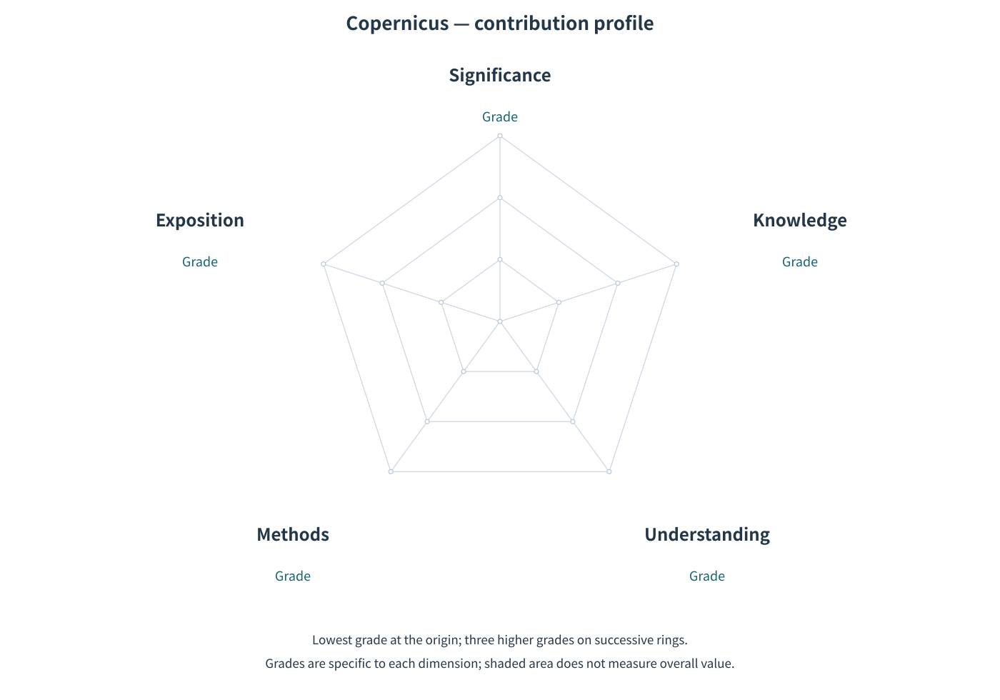

# Five-Dimensional Criteria and a Five-Axis Profile for Mathematical Contributions

*An implementation scheme for the Copernican Initiative*

[中文](Assessment-Scheme.zh.md) · [The initiative](Copernicus.en.md)

Based on the Copernican Initiative, this scheme translates the distinctions between Knowledge, Understanding, Methods, Exposition, and Mathematical Significance into specific criteria, four grades per dimension, and a five-axis diagram. It is one scheme offered for discussion, adoption, and revision; accepting the initiative's guiding position does not require accepting every grade distinction or graphical choice here. The criteria and their presentation may evolve with practice, with changes and their reasons made explicit.

## Basis of assessment

The Copernican Initiative calls for understanding a work’s contribution to the community through the mathematics it presents. Making that assessment concrete requires answering a central question: **Relative to the knowledge and understanding available at the time, what improvement does this work provide, and why does it matter?**

A work may take the form of a single paper or several interdependent papers. In the latter case, the series needs to be considered as a whole for its contribution to become clear.

Assessment can proceed along five dimensions:

- **Knowledge:** Which conclusions are newly established, which errors are corrected, which conditions of applicability are clarified, or what reliable grounds are added for existing conclusions?
- **Understanding:** Which concepts or difficulties are clarified, which connections are revealed, and what is explained about the role of assumptions or the mechanisms behind phenomena?
- **Methods:** What means of argument, construction, computation, or verification are provided, making tasks feasible or existing approaches more effective?
- **Exposition:** How do explanation, representation, and organization make mathematical content easier to understand, check, and use?
- **Significance:** What important difficulties do these advances resolve, or how do they advance our understanding of important mathematical objects, structures, and problems?

The first four dimensions identify where a work contributes; Mathematical Significance assesses the weight of those contributions. All five concern **the contribution already made at the time**, without relying on later adoption, dissemination, or influence. A new work can therefore be assessed on its mathematical content even before it receives wide attention.

We propose four grades for each dimension to describe the contribution it captures. They distinguish the changes a work brings relative to existing knowledge and understanding: from no improvement, through local advances, to overcoming key obstacles or bringing about fundamental change. These changes take different forms in each dimension, so each has its own grade names and criteria. The grounds for a grade lie in the specific mathematical advance; the number of theorems, the fame of a problem, or the effort invested cannot directly determine the weight of a contribution.

The following sections explain the five dimensions and their grades in turn. A work may contribute along several dimensions at once: a new proof may both establish a result and reveal why it holds, while clearer exposition may help readers grasp connections that were previously difficult to understand. Discussing these aspects separately helps explain the character of each contribution and how they together give the work its value.

## Knowledge

**What knowledge is established, and which grounds are strengthened?**

The mathematical community builds further research on established results and their proofs. New theorems add to what we know; correcting errors, clarifying conditions, and repairing proof gaps make that knowledge more accurate and reliable. Contributions to knowledge therefore include both discovering previously unknown facts and providing firmer grounds for existing understanding. Independent verification can also improve reliability when it resolves specific doubts.

| Grade | Knowledge criterion |
|---|---|
| **No Advance in Knowledge** | Adds or corrects no conclusions, clarifies no conditions of applicability, and provides no firmer grounds for existing conclusions. |
| **A Step Forward** | Adds or corrects specific conclusions, clarifies their scope, or provides firmer grounds for them, yielding a local advance. |
| **A Decisive Advance** | Establishes or corrects conclusions, clarifies their scope, or provides firmer grounds for them, removing a key obstacle in existing knowledge. |
| **Foundational Advance** | Makes a fundamental advance in conclusions, their scope, or their justification, establishing or rebuilding the foundations of the relevant mathematical knowledge. |

Repairing a proof gap may correct a local argument, or it may provide reliable grounds for an entire body of results that depends on that argument. The difference lies in what the community could not previously regard as secure and what it can now establish on that basis. A small textual repair may therefore have foundational value, while an imposing theorem may add little knowledge. The grade expresses this change in knowledge, rather than the length of the work, the number of conclusions, or the number of fields involved.

## Understanding

**Which questions are clarified, and which relationships or mechanisms are revealed?**

The mathematical community seeks to know not only which results hold, but why they hold and how they are connected. The role of an assumption, the motivation for a construction, or the reason an approach fails may be a missing part of our understanding. Making these connections clear helps us grasp a problem more accurately. Good questions can contribute in this way too: they separate what was confused and reveal difficulties previously overlooked.

| Grade | Understanding criterion |
|---|---|
| **No New Insight** | Offers no clearer understanding of questions, relationships, or mechanisms, and no new perspective. |
| **Fresh Insight** | Clarifies specific conceptual distinctions, the role of assumptions, relationships, or reasons for success or failure, deepening understanding locally. |
| **Key Insight** | Explains a central mechanism or clarifies a problem’s essential structure, implicit premises, and dependencies, making clear where these insights apply. |
| **Understanding Recast** | Reveals key connections missed by prior understanding, changing conceptual distinctions or explanations so that the structure of a problem or the reasons behind phenomena can be understood anew. |

Clarifying why an assumption is indispensable may explain why a proof succeeds. Discovering that our conceptual distinctions conceal the structure actually at work may lead us to reformulate and understand the whole problem anew. This illustrates the difference in depth between explaining a crucial step and changing a prior way of understanding. New terminology or a unified language does not by itself ensure the latter change; its value lies in revealing previously unrecognized connections. Such a contribution may deepen a single question or connect different phenomena.

## Methods

**Which tasks become feasible, and which costs fall?**

Contributions to methods add to the mathematical means available to the community. A new proof strategy, construction, or computational method can make difficult work feasible, reduce the effort it requires, or remove restrictions. Refinements and combinations of existing methods can offer these benefits too. This dimension concerns how we can now do mathematics, which is distinct from the new conclusions obtained by applying a method.

| Grade | Methods criterion |
|---|---|
| **No Improvement** | Under the same conditions, makes no additional tasks feasible and does not reduce the cost of completing them. |
| **Effective Refinement** | Improves particular steps, reduces resource use, or relaxes conditions of use, yielding a local improvement. |
| **Limits Overcome** | Overcomes a substantive limitation of existing methods in applicability, procedures, or resource requirements, making previously difficult tasks feasible or substantially reducing resource needs or increasing the scale that can be handled. |
| **Methods Transformed** | Develops a methodological breakthrough into a mathematically justified system of methods that overcomes substantive obstacles across tasks or escapes a key limitation shared by prior methods for a class of tasks. |

A technique that works in several examples need not change the community’s methods. What matters is whether those examples merely repeat the same step or whether the new method overcomes obstacles that previous approaches could not handle. When the latter provides a systematic way forward or frees a class of problems from a shared limitation, it shows the depth of Methods Transformed. Such a breakthrough can occur within one class of problems; its practical benefits also depend on its assumptions, scope, and resource requirements.

## Exposition

**Which obstacles to understanding, checking, and use are removed?**

Exposition makes mathematical results into knowledge that others can grasp and use. Apt explanations, notation, and organization of arguments can help readers understand why an idea was introduced, how a proof develops, and how a result applies. This reduces barriers to communication and helps the community check and pass on mathematics. Improving the presentation, representation, and organization of existing material can contribute even without new results or new explanations; improvements for experts and explanations for beginners each have value.

| Grade | Exposition criterion |
|---|---|
| **No Better Access** | Makes the material no easier to understand, check, or use than existing accounts do. |
| **Local Clarification** | Uses specific explanations, representations, or arrangements of material to make particular content easier to understand, check, or use. |
| **The Structure Made Clear** | Organizes key ideas, arguments, and details effectively, helping readers distinguish what matters and grasp the roles and connections of the parts. |
| **Depth Made Accessible** | Uses effective explanation, representation, or organization to make previously hard-to-convey central content clear without distortion, enabling readers to grasp its internal connections and crucial distinctions. |

An article may be complete and clearly ordered yet leave readers unsure why a definition is natural or a construction works. More detail may not resolve such a difficulty, while an apt example, representation, or approach to explanation may bring the central idea into view. This is where Depth Made Accessible goes beyond better organization. It does not require dispensing with necessary mathematical background, but allows readers with that background to grasp the mathematics more directly, with fewer barriers created by its presentation.

## Mathematical significance

**Why do these improvements merit the community's attention?**

The first four dimensions describe what the community gains; Mathematical Significance asks why those gains matter. A result may matter because it settles a crucial problem, an explanation because it changes our understanding of a central structure. Methods and exposition can likewise fundamentally improve how people study and grasp mathematics. Significance therefore requires an understanding of the particular mathematics involved and cannot be calculated by adding the other four grades.

| Grade | Significance criterion |
|---|---|
| **Limited Value** | Adds no contribution beyond existing work, or improves only minor details. |
| **A Worthwhile Contribution** | Offers concrete help in solving or understanding a particular problem, without changing the main research obstacles or the basic conditions on which understanding of that problem depends. |
| **A Major Advance** | Removes a key obstacle along a research direction or substantially advances the community’s understanding and handling of the mathematical objects, structures, or problems concerned. |
| **A Major Breakthrough** | Through results already achieved, fundamentally changes the conditions under which the community establishes mathematical conclusions, understands mathematical ideas, solves mathematical problems, or grasps important mathematics. |

A work confined to a special case may remove an obstacle along an important research direction, while a formally general framework may leave every crucial aspect of our understanding unchanged. Breadth therefore cannot directly determine significance. Likewise, solving a difficult problem does not automatically constitute a Major Breakthrough. The deeper question is whether the work provides previously missing reliable foundations, explanations, or means of treatment for important mathematics, thereby changing how the community can study and grasp it. The assessment concerns changes already achieved; subsequent influence is a separate historical question.

## Collaboration and checking

Sustaining the initiative requires the joint participation of humans and AI; this does not require AI in every assessment. In such collaboration, AI assists with checking and comparison, while experts familiar with the content examine crucial comparisons, arguments, and the significance of the gains. Omissions and disagreements call for further investigation.

This collaboration does not assign all facts to AI and all value judgments to people. Whether a prior result applies or two conclusions are equivalent already requires mathematical judgment; the weight of a contribution must also rest on concrete facts. AI may propose judgments, and people must participate in checking evidence. Both are open to examination and correction. AI confidence, agreement among models, or one expert's endorsement cannot by themselves replace reasons or establish community consensus.

## How assessment proceeds

An assessment concerns a clearly identified mathematical work and makes its grounds and judgments open to checking and correction.

1. **Define the work and comparison context.** Specify the version, scope, and research context when the work appeared. If interdependent papers jointly deliver a contribution, determine the unit from their actual dependencies. Promised but unfinished parts cannot count as achieved contributions.
2. **Check the specific gains.** Read the arguments supporting the contribution and the relevant prior work. Explain what was previously known or feasible and what this work changes, with locatable evidence. When humans and AI collaborate, AI assists with search, comparison, and checking; people examine crucial sources and inferences. Failure to find a precedent does not establish originality.
3. **Examine contributions and their weight.** Distinguish gains in Knowledge, Understanding, Methods, and Exposition, and assess their significance through the specific mathematical questions involved. Separate help supplied by the work from explanations added by the evaluator. Assess exposition for human readers with the relevant background, not by whether AI can summarize it.
4. **Present and revise the assessment.** State what was checked, which judgments remain uncertain, and where disagreements lie. New evidence can change an assessment; revisions should identify the judgments changed and the reasons. Reviewers need not be forced to agree on every grade.

These steps provide a way to work together, not a guarantee of complete or unanimous conclusions. An evaluator's inability to understand an argument does not establish that the work lacks a contribution. Conversely, a known missing argument must not be concealed as merely awaiting verification. Distinguish unavailable materials, limits of the evaluator, and defects in the work, explaining which judgments each affects.

## Assessment results

An assessment should let readers see which prior knowledge the work is compared with, what it adds, the specific mathematical grounds for judging its weight, its conditions, costs, and limitations, and which arguments have been checked or judgments remain unresolved. Distinguish AI-proposed inferences from opinions reached after human examination, stating the actual scope of that examination. Human participation does not certify the entire assessment.

Contribution grades do not replace correctness checking. If an assessment depends on a crucial unchecked premise, identify it and its consequences; an anticipated repair cannot supply a contribution missing because of a known gap. An unresolved dimension does not prevent reporting other supported findings, and an unknown grade must not be replaced by the lowest grade. Preserve the reasons for disagreements about significance rather than averaging grades to remove them.

A five-axis diagram can summarize contributions to Knowledge, Understanding, Methods, Exposition, and Significance when all five judgments have grounds, accompanied by mathematical reasons and necessary qualifications. If the evidence does not support a complete set of grades, present only the supported textual assessment. Grades do not combine into a total score, and diagram area does not represent overall value. The reasons for an assessment remain more important than its diagram.

## Reading the five-axis diagram

*This is an unfilled schematic grid, not a set of grades for any particular work.*

The axes run clockwise from the top: Mathematical Significance, Knowledge, Understanding, Methods, and Exposition. Each uses the four ordered grades in its corresponding table: the lowest is at the shared origin, and the other three occupy successive rings. Positions indicate order within each dimension, not equal differences in contribution; the same ring on different axes does not indicate equal contributions.

An actual profile should state all five grades alongside the image and include their reasons and necessary qualifications. Draw from the judgments already made; do not adjust them to produce a fuller shape. Lowest-grade points remain at the origin. A complete all-lowest assessment can therefore appear as a point, and some combinations can appear as lines. An unknown grade is not a lowest grade: if any dimension remains ungraded, withhold the complete profile.

Although Mathematical Significance appears alongside the four kinds of contribution, it assesses their weight rather than adding a fifth contribution to them. Distances, connecting lines, and area do not constitute a total score. Human participation or the presence of a diagram does not establish shared agreement on the judgments; the accompanying text must still explain the actual scope of review and any disagreements.

## Long-term influence

How a contribution is used, revised, and developed often becomes clear only through subsequent research. Understanding its lasting influence involves examining the work it actually led to and the changes it brought to mathematical knowledge. Citation counts, popularity, or a period of non-use cannot answer those questions on their own.

This scheme is intended primarily for assessing new work, so its five grades exclude long-term influence. Influence that later materializes can be assessed separately as a matter of history; expectations of future influence cannot count as contributions already made.
